# Password Generator

## Table of Contents

- [Password Generator](#password-generator)
  - [Table of Contents](#table-of-contents)
  - [Description](#description)
  - [Demonstration](#demonstration)
  - [Usage](#usage)
  - [Deployed Webpage](#deployed-webpage)
  - [Installation](#installation)
  - [Credits](#credits)
  - [License](#license)

 

## Description

The objective of establishing this repository is to develop a website that can produce random passwords according to specific user-defined criteria and desired password length.

 

## Demonstration

Here is a short demonstration of the website:

 

## Usage

The password generation process will include prompts to guide the user along the way: 

1. Once the user opens up the webpage, they will be prompted to press the red button.  
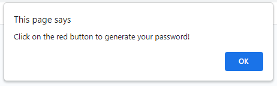

2. After the user presses the "Generate Password" button, they will prompted to enter a desired password length.  
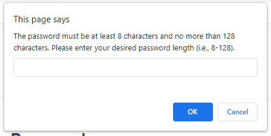

3. After the user inputs the desired password length, they will be presented with a series of questions to select the types of characters they want to include in their password.  
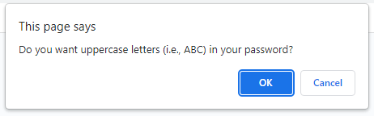

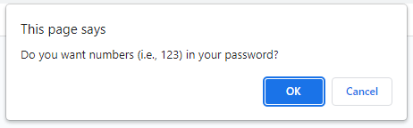
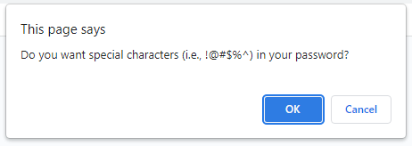

4. Once the user answers all the prompts, a password is then generated inside the dashed box.  
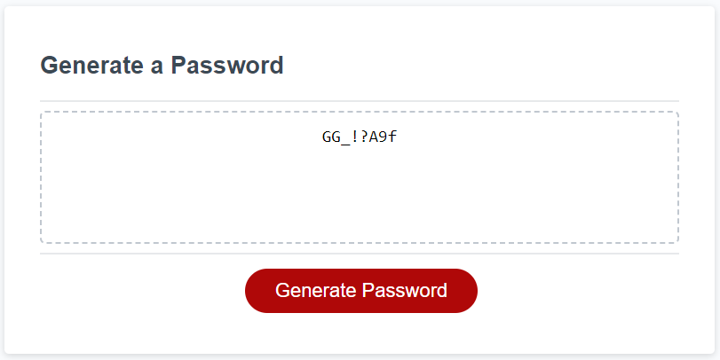

  
If the user enters an invalid password length, then they will see the following:

1. An alert prompt that tells the user to enter an interger.  
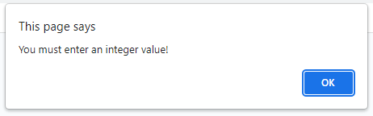

2. A confirm message will ask the user whether or not they would like to try again.  
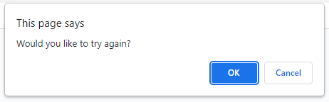

3. If user presses cancel, then they will see a message.  
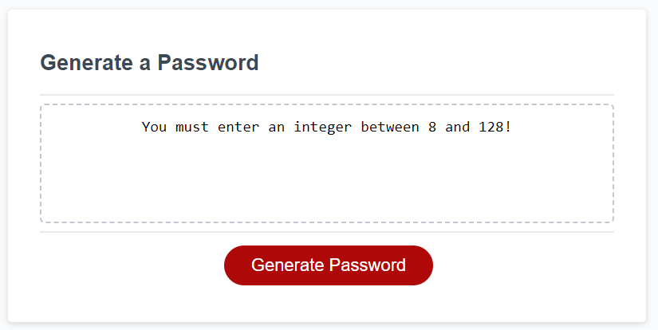

4. If the user presses ok, then they will be redirected to enter a valid password length.

  
If the user choose to have none of the character types, then they will see:

1. An alert prompt that tells the user to select at least one character type.  
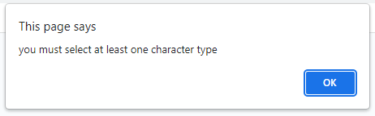

2. A confirm message will ask the user whether or not they would like to try again.  

3. If user presses cancel, then they will see a message.  
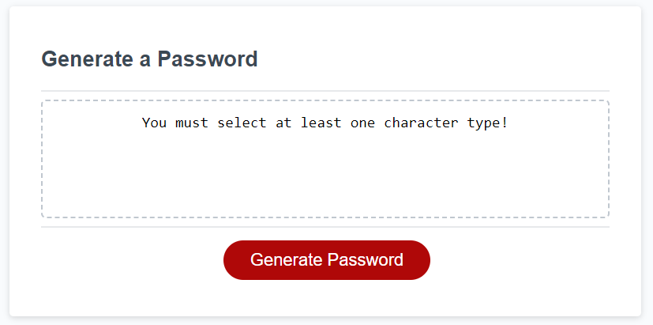

4. If the user presses ok, then they will be redirected to select character types again.

 

## Deployed Webpage

https://ronachen99.github.io/password-generator/

 

## Installation

No installation prerequisites are necessary.

 

## Credits

N/A

 

## License

N/A
